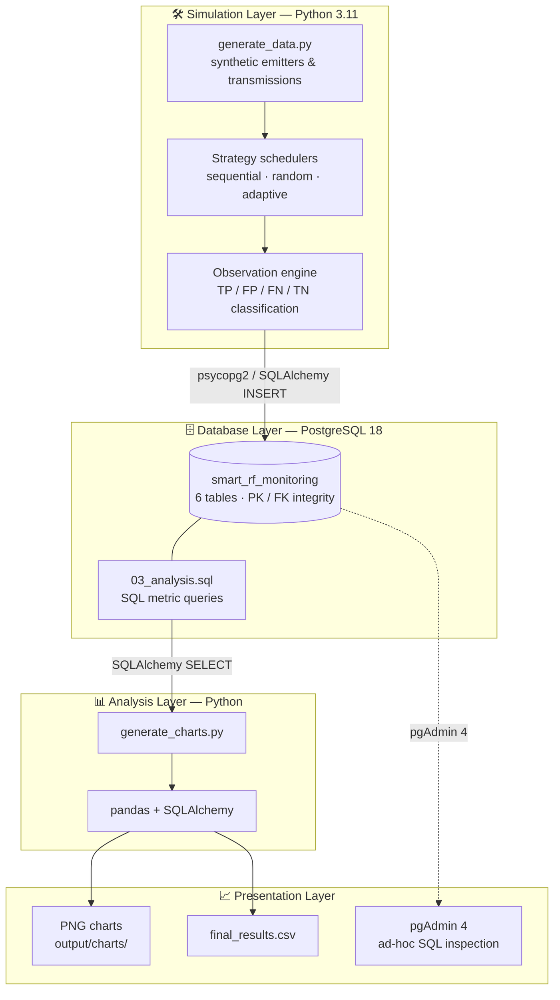
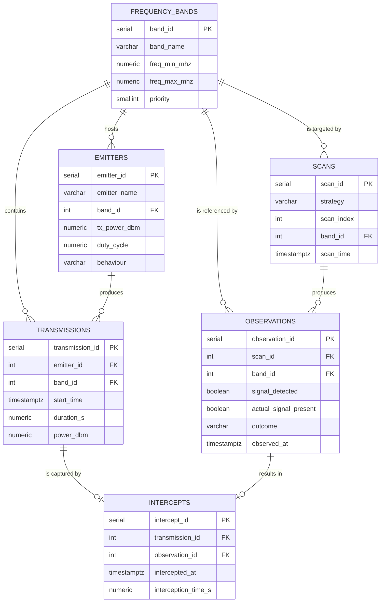
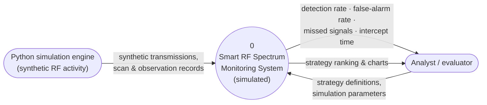
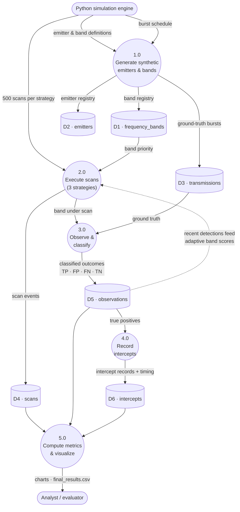
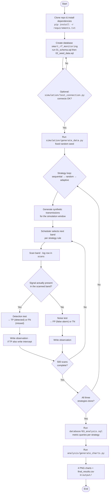
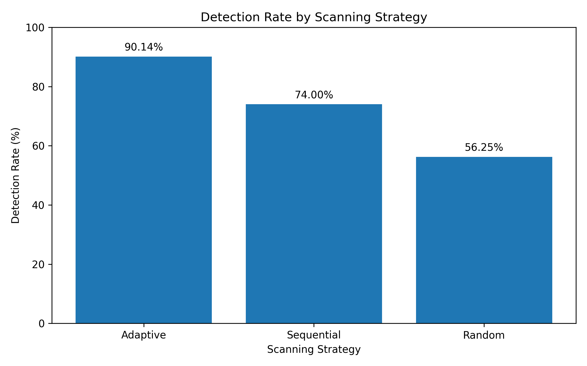
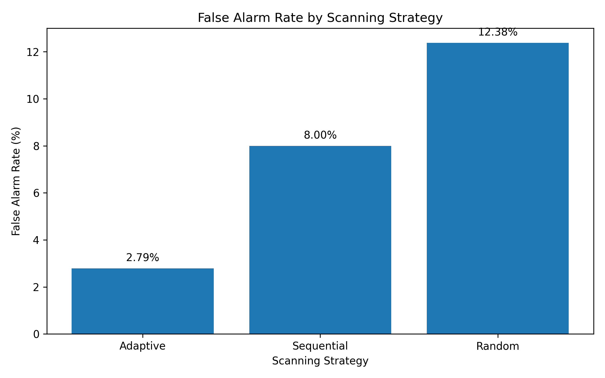
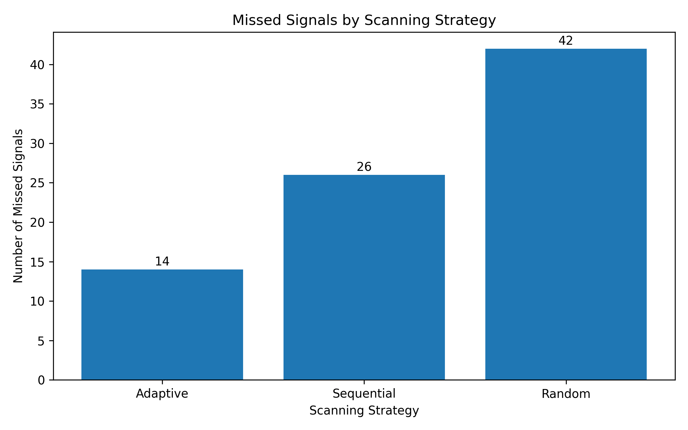
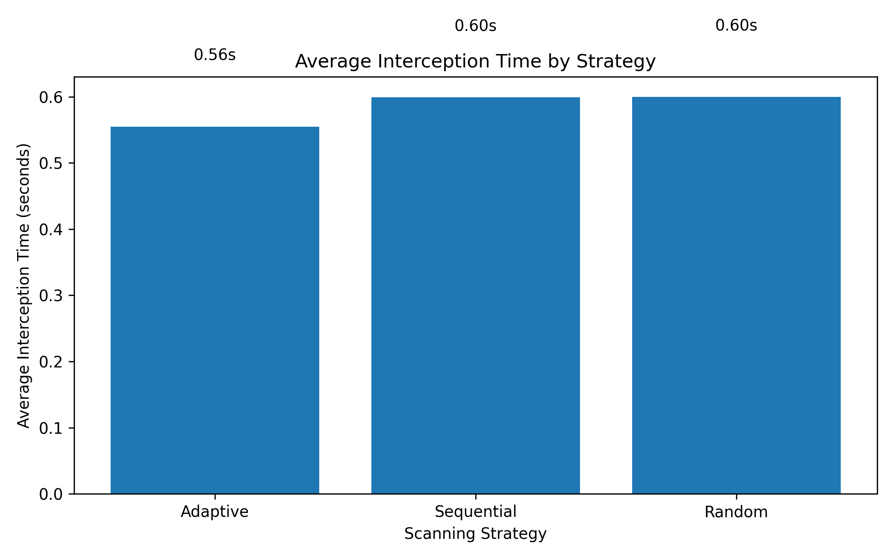

# 📡 Smart RF Spectrum Monitoring Database Using SQL


A database-driven mini-project that **simulates** an RF spectrum monitoring system using **PostgreSQL** and **Python**, stores synthetic frequency-band activity, receiver scans, observations and successful interceptions in a relational database, and compares **three scanning strategies** — **Sequential**, **Random**, and **Adaptive** — on detection rate, false-alarm rate, missed signals, and average interception time.

> **🏆 Result (within this simulation):** the **Adaptive** strategy won on *every* metric —
> **90.14 %** detection rate · **2.79 %** false-alarm rate · **14** missed signals · **0.555 s** average interception time.

> ⚠️ **Safety note:** This project uses **entirely simulated RF activity**. It does not monitor, record, decode, or process live hostile signals or unauthorized RF communications. All transmissions, emitters, and detections are synthetic data generated by a Python script.

---

## Table of Contents

1. [Project Overview](#1-project-overview)
2. [Objectives](#2-objectives)
3. [Technologies Used](#3-technologies-used)
4. [System Architecture](#4-system-architecture)
5. [Database Design](#5-database-design)
6. [Data Flow Diagrams (DFD)](#6-data-flow-diagrams-dfd)
7. [End-to-End Flow Diagram](#7-end-to-end-flow-diagram)
8. [Butterfly Diagram (Integration View)](#8-butterfly-diagram-integration-view)
9. [Scanning Strategies](#9-scanning-strategies)
10. [Simulation](#10-simulation)
11. [Performance Metrics](#11-performance-metrics)
12. [Results](#12-results)
13. [Project Structure](#13-project-structure)
14. [Setup](#14-setup)
15. [Running the Simulation](#15-running-the-simulation)
16. [Running the Analysis](#16-running-the-analysis)
17. [Troubleshooting](#17-troubleshooting)
18. [Limitations](#18-limitations)
19. [Future Scope](#19-future-scope)
20. [Conclusion](#20-conclusion)
21. [Appendix A — Glossary](#appendix-a--glossary)
22. [License](#license)

---

## 1. Project Overview

This mini-project implements a **simulated RF spectrum monitoring system** backed by a relational database.

The system stores:

- Simulated **frequency-band activity** (synthetic transmissions from simulated emitters)
- **Receiver scanning operations** for three different strategies
- **Observations** made by the simulated receiver, classified against ground truth
- **Successful interceptions** and their interception times

It then compares three scanning strategies:

| # | Strategy | Idea |
|---|----------|------|
| 1 | **Sequential** | Visit bands in fixed order, round-robin |
| 2 | **Random** | Pick a band uniformly at random each scan |
| 3 | **Adaptive** | Score each band using priority + recent detection history and scan the highest-scoring band |

The **adaptive strategy prioritizes frequency bands where recent signal detections have occurred**, so the receiver spends its scan budget where activity is most likely.

**Project at a glance**

| Attribute | Detail |
|-----------|--------|
| Project type | Database + simulation mini-project |
| Domain | RF spectrum monitoring (fully simulated) |
| Database | PostgreSQL 18 — `smart_rf_monitoring` |
| Core tables | 6 (`frequency_bands`, `emitters`, `transmissions`, `scans`, `observations`, `intercepts`) |
| Strategies compared | Sequential · Random · Adaptive |
| Simulation volume | 10 bands · 5 emitters · ~200–300 transmissions · 1,500 scans |
| Reproducibility | Fixed random seed in `simulation/generate_data.py` |
| Best performer (in-simulation) | **Adaptive scanning** |

---

## 2. Objectives

1. Design a relational database for simulated RF spectrum monitoring.
2. Generate synthetic transmission and scanning data.
3. Compare **sequential**, **random**, and **adaptive** scanning strategies.
4. Calculate **detection rate** and **false-alarm rate**.
5. Measure **missed signals**.
6. Measure **average interception time**.
7. Visualize the performance of each scanning strategy.
8. Determine the best-performing strategy under the simulation assumptions.

---

## 3. Technologies Used

| Technology | Version | Purpose |
|------------|---------|---------|
| PostgreSQL | 18 | Relational database for spectrum, scan, observation, and intercept data |
| pgAdmin 4 | — | Database administration and SQL execution |
| Python | 3.11 | Simulation and analysis |
| psycopg2 | 2.9+ | PostgreSQL connectivity |
| SQLAlchemy | 2.x | Database connection engine for pandas |
| pandas | 2.x | Data analysis and metric computation |
| Matplotlib | 3.x | Visualization (performance charts) |
| Git / GitHub | — | Version control and project hosting |

---

## 4. System Architecture

The system is organized in four layers. The simulation layer produces synthetic data, the database layer stores it, the analysis layer computes metrics with SQL + pandas, and the presentation layer renders charts and result files.



A rendered image version is available at [`output/System_Architecture.png`](output/System_Architecture.png).

---

## 5. Database Design

The database contains **six tables** linked by primary-key / foreign-key relationships.

### 5.1 Entity-Relationship (ER) Diagram



A rendered image version is available at [`output/ER_Diagram.png`](output/ER_Diagram.png).

### 5.2 Table Definitions

> ℹ️ The tables below summarize `database/01_schema.sql`. The schema file is authoritative — exact column names may differ slightly.

**`frequency_bands`** — monitored frequency bands, ranges, and priority values.

| Column | Type | Constraints | Description |
|--------|------|-------------|-------------|
| `band_id` | `SERIAL` | **PK** | Unique band identifier |
| `band_name` | `VARCHAR` | `NOT NULL`, `UNIQUE` | Human-readable band label |
| `freq_min_mhz` | `NUMERIC` | `NOT NULL`, `CHECK (freq_min_mhz < freq_max_mhz)` | Lower band edge (MHz) |
| `freq_max_mhz` | `NUMERIC` | `NOT NULL` | Upper band edge (MHz) |
| `priority` | `SMALLINT` | `NOT NULL`, `CHECK (1–5)` | Baseline monitoring priority |

**`emitters`** — simulated signal sources and their characteristics.

| Column | Type | Constraints | Description |
|--------|------|-------------|-------------|
| `emitter_id` | `SERIAL` | **PK** | Unique emitter identifier |
| `emitter_name` | `VARCHAR` | `NOT NULL` | Simulated source label |
| `band_id` | `INT` | **FK →** `frequency_bands` | Band the emitter operates in |
| `tx_power_dbm` | `NUMERIC` | `NOT NULL` | Simulated transmit power |
| `duty_cycle` | `NUMERIC` | `NOT NULL` | Fraction of time the emitter is active |
| `behaviour` | `VARCHAR` | — | Activity pattern profile |

**`transmissions`** — ground-truth simulated signal activity.

| Column | Type | Constraints | Description |
|--------|------|-------------|-------------|
| `transmission_id` | `SERIAL` | **PK** | Unique transmission identifier |
| `emitter_id` | `INT` | **FK →** `emitters` | Emitting source |
| `band_id` | `INT` | **FK →** `frequency_bands` | Band the burst occupies |
| `start_time` | `TIMESTAMPTZ` | `NOT NULL` | Burst start (simulated clock) |
| `duration_s` | `NUMERIC` | `NOT NULL` | Burst duration (seconds) |
| `power_dbm` | `NUMERIC` | — | Simulated received power |

**`scans`** — scanner actions and the strategy used for each scan.

| Column | Type | Constraints | Description |
|--------|------|-------------|-------------|
| `scan_id` | `SERIAL` | **PK** | Unique scan identifier |
| `strategy` | `VARCHAR` | `NOT NULL`, `CHECK IN ('sequential','random','adaptive')` | Strategy that produced this scan |
| `scan_index` | `INT` | `NOT NULL` | Order of the scan within its strategy run (1–500) |
| `band_id` | `INT` | **FK →** `frequency_bands` | Band visited by this scan |
| `scan_time` | `TIMESTAMPTZ` | `NOT NULL` | Simulated time of the scan |

**`observations`** — the simulated receiver's observations, compared against ground truth.

| Column | Type | Constraints | Description |
|--------|------|-------------|-------------|
| `observation_id` | `SERIAL` | **PK** | Unique observation identifier |
| `scan_id` | `INT` | **FK →** `scans` | Scan that produced this observation |
| `band_id` | `INT` | **FK →** `frequency_bands` | Band observed |
| `signal_detected` | `BOOLEAN` | `NOT NULL` | Receiver's claim: signal seen? |
| `actual_signal_present` | `BOOLEAN` | `NOT NULL` | Ground truth: signal actually present? |
| `outcome` | `VARCHAR` | `CHECK IN ('TP','FP','FN','TN')` | Confusion-matrix outcome |
| `observed_at` | `TIMESTAMPTZ` | `NOT NULL` | Simulated observation time |

**`intercepts`** — successful detections and their interception times.

| Column | Type | Constraints | Description |
|--------|------|-------------|-------------|
| `intercept_id` | `SERIAL` | **PK** | Unique intercept identifier |
| `transmission_id` | `INT` | **FK →** `transmissions` | Ground-truth burst that was captured |
| `observation_id` | `INT` | **FK →** `observations` | Observation that caught it |
| `intercepted_at` | `TIMESTAMPTZ` | `NOT NULL` | Simulated intercept timestamp |
| `interception_time_s` | `NUMERIC` | `NOT NULL` | Delay from transmission start to intercept |

### 5.3 Relationships

| Parent table | Child table | Foreign key | Cardinality | Meaning |
|--------------|-------------|-------------|-------------|---------|
| `frequency_bands` | `emitters` | `band_id` | 1 : N | Each band hosts many emitters |
| `frequency_bands` | `transmissions` | `band_id` | 1 : N | Transmissions occur inside bands |
| `frequency_bands` | `scans` | `band_id` | 1 : N | Each scan targets one band |
| `frequency_bands` | `observations` | `band_id` | 1 : N | Each observation refers to one band |
| `emitters` | `transmissions` | `emitter_id` | 1 : N | Each emitter produces many bursts |
| `transmissions` | `intercepts` | `transmission_id` | 1 : 0..1 | A burst is captured at most once |
| `scans` | `observations` | `scan_id` | 1 : N | Each scan yields one observation |
| `observations` | `intercepts` | `observation_id` | 1 : 0..1 | A TP observation yields one intercept |

---

## 6. Data Flow Diagrams (DFD)

### 6.1 Level 0 — Context Diagram

The system as a single process, showing external entities and the data flowing in and out.



### 6.2 Level 1 — Decomposed Data Flow

The system decomposed into five processes and six data stores (the database tables).



> 🔁 Note the feedback arrow from `D5 observations` back into **2.0 Execute scans** — this is exactly what distinguishes the **adaptive** strategy: its band scores are updated from recent detection outcomes, while sequential and random ignore history.

---

## 7. End-to-End Flow Diagram

The complete workflow, from repository setup to final charts.



---

## 8. Butterfly Diagram (Integration View)

The butterfly view mirrors the two halves of the system around a shared center — the PostgreSQL database:

- **Left wing (data production):** everything that *writes* into the database
- **Body (data core):** the six relational tables with PK/FK integrity
- **Right wing (data consumption):** everything that *reads* out of the database

Everything the left wing produces, the right wing consumes — the database is the axis that joins them.

```mermaid
flowchart LR
    subgraph LW["🛠 Left Wing — Simulation (Data Production)"]
        direction TB
        L0(["Simulation parameters<br/>+ fixed random seed"]) --> L1["Synthetic emitters<br/>5 sources across 10 bands"]
        L1 --> L2["Synthetic transmissions<br/>~200–300 bursts"]
        L2 --> L3["Scan schedulers<br/>sequential · random · adaptive"]
        L3 --> L4["Observation engine<br/>TP · FP · FN · TN"]
    end

    subgraph BODY["🗄 Body — PostgreSQL Data Core"]
        direction TB
        C1[("smart_rf_monitoring<br/>6 tables · PK/FK integrity<br/>· indexes · constraints")]
    end

    subgraph RW["📊 Right Wing — Analysis (Data Consumption)"]
        direction TB
        R1["SQL analytics<br/>database/03_analysis.sql"] --> R2["Metric computation<br/>detection · false alarm ·<br/>missed · intercept time"]
        R2 --> R3["Matplotlib charts<br/>output/charts/"]
        R2 --> R4["final_results.csv"]
        R3 --> R5(["Analyst report<br/>& strategy ranking"])
        R4 --> R5
    end

    L4 ==>|"INSERT<br/>raw records"| C1
    C1 ==>|"SELECT<br/>aggregated results"| R1
```



---

## 9. Scanning Strategies

### 9.1 Sequential

The scanner visits the frequency bands in a fixed order:

```text
Band 1 → Band 2 → Band 3 → ... → Band 10 → Band 1
```

Simple and predictable, but it does not react to previously detected activity.

### 9.2 Random

The scanner randomly selects a frequency band for each scan. This provides exploration but uses no information from previous detections.

### 9.3 Adaptive

The adaptive strategy maintains a **score for each frequency band**, influenced by:

- Original band **priority**
- Recent **successful detections**
- Recent **missed signals**
- **Recency** of the last detection

Bands with recent successful detections receive higher priority. This is a **rule-based adaptive scheduler** — it does **not** use machine learning.

### 9.4 Strategy Comparison

| Property | Sequential | Random | Adaptive |
|----------|:----------:|:------:|:--------:|
| Band selection rule | Fixed round-robin | Uniform random | Score-based (priority + history) |
| Uses detection history | ❌ No | ❌ No | ✅ Yes |
| Exploration | ❌ None | ✅ Maximum | ⚖️ Balanced |
| Predictable pattern | ✅ Fully | ❌ No | ❌ No |
| Reacts to recent activity | ❌ No | ❌ No | ✅ Yes |
| Implementation complexity | Low | Low | Medium |
| Best suited for (in-simulation) | Uniform, steady traffic | Unknown traffic spread | Clustered / bursty traffic |

---

## 10. Simulation

The Python simulation generates synthetic RF transmissions and scanning activity.

| Parameter | Value |
|-----------|-------|
| Frequency bands | 10 |
| Simulated emitters | 5 |
| Simulated transmissions | ~200–300 |
| Scans per strategy | 500 |
| Total scans | 1,500 |
| Total observations | 1,500 |
| Strategies | 3 (sequential, random, adaptive) |
| Random seed | Fixed (set in `simulation/generate_data.py`) |

A **fixed random seed** makes the entire simulation **reproducible**: the same seed, parameters, and code always regenerate the same dataset and results.

---

## 11. Performance Metrics

### 11.1 Confusion Matrix

Each observation is classified against the ground truth as one of four outcomes:

| | **Signal present (truth)** | **No signal (truth)** |
|---|:---:|:---:|
| **Receiver claims detection** | ✅ True Positive (TP) — intercept | ❌ False Alarm (FP) |
| **Receiver reports clear** | ❌ Missed Signal (FN) | ✅ True Negative (TN) |

### 11.2 Definitions and Formulas

| Metric | Formula | Question it answers |
|--------|---------|---------------------|
| **Detection Rate** | `TP / (TP + FN) × 100` | What % of actual signals were intercepted? |
| **False-Alarm Rate** | `FP / (FP + TN) × 100` | What % of clear-band observations were wrongly called detections? |
| **Missed Signals** | `COUNT(FN)` | How many real signals did the receiver fail to detect? |
| **Average Interception Time** | `AVG(interception_time_s)` | Mean simulated delay from transmission start to successful intercept |

### 11.3 Key SQL (abridged from `database/03_analysis.sql`)

```sql
-- Confusion-matrix outcome counts per strategy
SELECT  s.strategy,
        COUNT(*) FILTER (WHERE o.outcome = 'TP') AS true_positives,
        COUNT(*) FILTER (WHERE o.outcome = 'FP') AS false_alarms,
        COUNT(*) FILTER (WHERE o.outcome = 'FN') AS missed_signals
FROM    observations o
JOIN    scans s USING (scan_id)
GROUP BY s.strategy
ORDER BY s.strategy;

-- Average interception time per strategy
SELECT  s.strategy,
        ROUND(AVG(i.interception_time_s)::numeric, 3) AS avg_interception_time_s
FROM    intercepts i
JOIN    observations o USING (observation_id)
JOIN    scans s USING (scan_id)
GROUP BY s.strategy;
```

> ℹ️ Abridged for readability — the authoritative metric definitions live in `database/03_analysis.sql`.

---

## 12. Results

### 12.1 Final Results

Under the current simulation parameters:

| Strategy | Detection Rate ↑ | False-Alarm Rate ↓ | Missed Signals ↓ | Avg. Interception Time ↓ | Overall Rank |
|:---------|-----------------:|-------------------:|-----------------:|--------------------------:|:------------:|
| **Adaptive** 🏆 | **90.14 %** | **2.79 %** | **14** | **0.555 s** | **1** |
| Sequential | 74.00 % | 8.00 % | 26 | 0.599 s | 2 |
| Random | 56.25 % | 12.38 % | 42 | 0.600 s | 3 |

### 12.2 Adaptive vs. the Others (Relative Improvement)

| Metric | Adaptive vs Sequential | Adaptive vs Random |
|--------|-----------------------:|-------------------:|
| Detection rate | **+16.14 pp** | **+33.89 pp** |
| False-alarm rate | −5.21 pp | −9.59 pp |
| Missed signals | −12 (−46 %) | −28 (−67 %) |
| Avg. interception time | −0.044 s (−7.3 %) | −0.045 s (−7.5 %) |

### 12.3 Charts

| Detection Rate | False-Alarm Rate |
|---|---|
|  |  |

| Missed Signals | Average Interception Time |
|---|---|
|  |  |

Numerical results are also saved to [`output/final_results.csv`](output/final_results.csv).

### 12.4 Interpretation

The **adaptive strategy achieved the best overall performance** under the simulation parameters:

- ✅ The **highest detection rate** (90.14 %)
- ✅ The **lowest false-alarm rate** (2.79 %)
- ✅ The **fewest missed signals** (14)
- ✅ The **lowest average interception time** (0.555 s)

Because the adaptive scheduler keeps returning to bands with recent detections, it concentrates scan effort where synthetic activity actually clusters — which is why it dominates every metric in this dataset. Sequential scanning performs respectably but wastes scans on quiet bands, and random scanning spreads its 500 scans thinly across all bands regardless of activity.

> ⚠️ **These results should not be interpreted as measurements of real-world RF monitoring performance.** They hold only within this simulation's assumptions (synthetic traffic, predefined detection probabilities, simplified timing model).

---

## 13. Project Structure

```text
Smart-RF-Spectrum-Monitoring/
│
├── database/
│   ├── 01_schema.sql          # Tables, PKs, FKs, constraints
│   ├── 02_seed_data.sql       # Frequency bands + emitters seed data
│   └── 03_analysis.sql        # Metric queries (detection, false alarm, ...)
│
├── simulation/
│   ├── test_connection.py     # Verifies DB connectivity from .env
│   └── generate_data.py       # Synthetic transmissions, scans, observations, intercepts
│
├── analysis/
│   └── generate_charts.py     # Fetches results from PostgreSQL, builds 4 charts + CSV
│
├── output/
│   ├── ER_Diagram.png
│   ├── System_Architecture.png
│   ├── final_results.csv
│   ├── charts/
│   │   ├── detection_rate.png
│   │   ├── false_alarm_rate.png
│   │   ├── missed_signals.png
│   │   └── average_interception_time.png
│   └── diagrams/              # Static PNG exports of the README diagrams
│       ├── Flow_Diagram.png
│       ├── DFD_Level0.png
│       ├── DFD_Level1.png
│       └── Butterfly_Diagram.png
│
├── .env                       # Local DB credentials — NEVER commit
├── .gitignore
├── requirements.txt
└── README.md
```

The `.env` file contains local database credentials and **must not be committed** to GitHub.

---

## 14. Setup

### 14.1 Prerequisites

| Requirement | Check with |
|-------------|------------|
| PostgreSQL 18 installed and running | `psql --version` |
| Python 3.11 available | `python --version` |
| A PostgreSQL user with database-creation rights | — |
| pgAdmin 4 (optional, for GUI access) | — |

### 14.2 Install Dependencies

```bash
pip install -r requirements.txt
```

`requirements.txt` typically includes `psycopg2-binary`, `sqlalchemy`, `python-dotenv`, `pandas`, and `matplotlib`.

### 14.3 Configure the Database

Create a PostgreSQL database named:

```text
smart_rf_monitoring
```

Then execute the schema and seed scripts **in order**:

```bash
psql -U postgres -d smart_rf_monitoring -f database/01_schema.sql
psql -U postgres -d smart_rf_monitoring -f database/02_seed_data.sql
```

(These can also be run from pgAdmin 4's Query Tool.)

### 14.4 Configure Environment Variables

Create a `.env` file in the project root:

```text
DB_HOST=127.0.0.1
DB_PORT=5432
DB_NAME=smart_rf_monitoring
DB_USER=postgres
DB_PASSWORD=your_password
```

Add `.env` to `.gitignore` — **do not commit this file**.

### 14.5 Verify the Connection (Optional)

```bash
python simulation/test_connection.py
```

---

## 15. Running the Simulation

From the project directory:

```bash
python simulation/generate_data.py
```

This generates the simulated transmission, scan, observation, and interception records with a fixed random seed.

**Expected data volume after a successful run:**

| Table | Approximate Rows |
|-------|-----------------:|
| `frequency_bands` | 10 |
| `emitters` | 5 |
| `transmissions` | 200–300 |
| `scans` | 1,500 (500 × 3 strategies) |
| `observations` | 1,500 |
| `intercepts` | = number of true positives per strategy |

---

## 16. Running the Analysis

```bash
python analysis/generate_charts.py
```

The script retrieves the results from PostgreSQL and generates:

- Detection rate chart → `output/charts/detection_rate.png`
- False-alarm rate chart → `output/charts/false_alarm_rate.png`
- Missed signals chart → `output/charts/missed_signals.png`
- Average interception time chart → `output/charts/average_interception_time.png`

The final numerical results are also saved to:

```text
output/final_results.csv
```

**Quick recap of the full pipeline:**

```bash
pip install -r requirements.txt
psql -U postgres -d smart_rf_monitoring -f database/01_schema.sql
psql -U postgres -d smart_rf_monitoring -f database/02_seed_data.sql
python simulation/generate_data.py
python analysis/generate_charts.py
```

---

## 17. Troubleshooting

| Symptom | Likely Cause | Fix |
|---------|--------------|-----|
| `connection refused` | PostgreSQL service not running | Start the PostgreSQL service; verify `DB_HOST` / `DB_PORT` |
| `password authentication failed` | Wrong credentials in `.env` | Correct `DB_USER` / `DB_PASSWORD`; ensure `.env` is in the project root |
| `database "smart_rf_monitoring" does not exist` | DB not created yet | Create it before running the SQL scripts |
| `relation "scans" already exists` | Schema script run twice | Re-run in a fresh database or drop the schema first |
| Charts generate but are empty | Tables contain no data | Run `simulation/generate_data.py` before the analysis |
| `ModuleNotFoundError` | Dependencies missing | Re-run `pip install -r requirements.txt` |

---

## 18. Limitations

This project is a controlled simulation and has several limitations:

1. Signal activity is **synthetically generated**.
2. Detection probabilities are **predefined simulation assumptions**.
3. The adaptive scheduler uses **rule-based scoring**, not machine learning.
4. The simulation does **not** model real RF propagation, interference, multipath effects, or hardware characteristics.
5. The **interception-time model is simplified**.
6. Results depend on the **selected simulation parameters and random seed**.

---

## 19. Future Scope

- More sophisticated adaptive scheduling
- Machine-learning-based signal prediction
- Dynamic band-priority learning
- More realistic RF channel models
- Signal classification
- Real-time dashboards
- Larger simulation datasets
- Additional scanning strategies
- PostgreSQL views and stored procedures
- Automated experiment comparison

---

## 20. Conclusion

The project demonstrates how a relational database can be used to **store, analyze, and compare** simulated RF spectrum monitoring strategies.

Under the defined simulation conditions, **adaptive scanning** achieved the highest detection rate, lowest false-alarm rate, fewest missed signals, and fastest average interception time — winning on all four metrics.

More broadly, the project shows the integration of **PostgreSQL**, **Python-based simulation**, **SQL analytics**, and **data visualization** into a single reproducible workflow: schema → seed → simulate → analyze → visualize.

---

## Appendix A — Glossary

| Term | Meaning |
|------|---------|
| **Band** | A monitored frequency range stored in `frequency_bands` |
| **Emitter** | A synthetic signal source stored in `emitters` |
| **Transmission** | A synthetic signal burst (ground truth) stored in `transmissions` |
| **Scan** | One visit of the receiver to one band under one strategy |
| **Observation** | The receiver's verdict for one scan, classified as TP / FP / FN / TN |
| **Intercept** | A successful detection of an actual transmission, with its timing |
| **Detection rate** | Share of actual signals successfully intercepted |
| **False-alarm rate** | Share of signal-free observations wrongly reported as detections |
| **Interception time** | Simulated delay between a transmission's start and its capture |
| **Adaptive scheduler** | Rule-based band scoring using priority and recent detection history |

---

## License

Released under the **MIT License**. If you publish this repository, add a `LICENSE` file and keep the simulation-only scope notice above.

> This project is for educational purposes. It simulates RF activity only and must not be presented as real-world spectrum-monitoring equipment or results.
